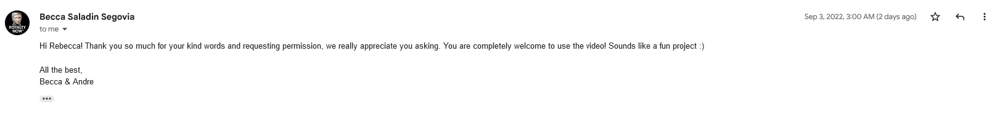

<h1>Portfolio Project 1 - HTML/CSS Essentials </h1>
 

'Marie Antoinette - The true story of her life a death' is a website that dispels the myths surrounding the historical figure, Marie Antoinette, by documenting the facts surrounding her life. This site was created for anyone eager to learn a lesser known side of Marie Antoinette's story. By showcasing the young Queen as a real person in both images and video, this site offers its audience the chance to see Marie-Antionette as a living, breathing person and by doing so, empathize with a young woman whose life was smeared by both past and present day misinformation. 

<h2>Live Site</h2>
 

<h2>Repository</h2>
 

<h2>Key Project Goals</h2>
<ul>
To showcase the facts of Marie Antoinette's life and death

</ul>
<ul>
To demonstrate my skillset as a developer using HMTL & CSS languages

</ul>

-Screenshot (a screenshot of the responsiveness of the website using the "am i responsive design.is")

-feature (includes main features and a short paragraph on what they are about, and how they benefit the user)

-Testing (testing section that should prove the site have been tested and functions as expected - also bug tested, 
list the bugs and what you did to fix them. If there are still unsolved bugs, list them too - testing websites are in
notebook)

- Accessibility (This is extremely important - don't forget to include all the alt attributes on images and make sure 
that the fore colour and background colour contrast nicely. - use lighthouse in inspect to check accessibility.)

<h2>Credits</h2>

Code Credits

<b>Homepage</b>

Timeline - Timeline structure code was built with the coding tutorial 'How to Create a Vertical Timeline - HTML & CSS Tutorial' by dcode. 
Link: https://www.youtube.com/watch?v=AIDiMA_C3sg

  Biography

Main biograpghy image was built using code from the Code Institute lesson 'Creating The Hero Image' in the 'Love Running Walktrough Project' on the 'Diploma in Full Stack Software Development (Common Curriculum)' couse. Link: https://learn.codeinstitute.net/courses/course-v1:CodeInstitute+LR101+2021_T1/courseware/4a07c57382724cfda5834497317f24d5/6fd29d155c3b42248ff57bae32978a4b/

The was made responsive using code from the video 'Embed a YouTube Video in HTML and Make it Responsive (CSS included)' by tipwithpunch on Youtube.
Link: https://www.youtube.com/watch?v=9YffrCViTVk&t=100s

  Gallery

Hover animation - The code for the hover animation on the 'Gallery' page was built with the code example of '#1 Hover animation'
by Vijay Thirugnanam on his website vijayt.com. Link: https://vijayt.com/post/hover-animation-blurred-image-and-other-css-tricks/

  

- Content Credits

Homepage 

The information in the 'Historical Lies' section of the home page was gathered from the article '10 Things You May Not Know About Marie Antoinette' by 
Christopher Klein on 'history.com'. Link: https://www.history.com/news/10-things-you-may-not-know-about-marie-antoinette

The information in the 'Timeline' section of the homepage was gathered from 'Marie Antoinette and the French Revolution' an article on 'pbs.org'. 
Link: https://www.pbs.org/marieantoinette/timeline/index.html

Biography

The information for the 'Biography' section was gathered from the following sources:

    'MARIE ANTOINETTE – TRAGIC TEEN QUEEN' by Jasmin K. Williams published on November 6, 2006 in the New York Post. Link here:
     https://nypost.com/2006/11/06/marie-antoinette-tragic-teen-queen/ 

    'What Happened to Marie Antoinette’s Children?' by Barbara Maranzani published on Oct 18, 2019 in Biograpghy.com. Link here:
     https://www.biography.com/news/marie-antoinette-children-louis-charles-marie-therese
    
    'Marie Antoinette' page on Wikipedia. Link here:
     https://en.wikipedia.org/wiki/Marie_Antoinette

Video

Permission to post the video 'Marie Antoinette: Her Life & Face Revealed' granted by the video content creator Becca Saladin Segovia
at Royalty Now Studios. Link to video here: https://www.youtube.com/watch?v=OXhEBfK3Njc&t=956s

Gallery

Images for Marie-Antoinette throughout the website were sourced from 'pexels.com'. Link here: https://www.pexels.com/search/Marie%20Antoinette/

