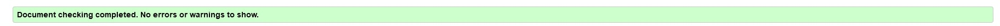

<h1>Portfolio Project 1 - HTML/CSS Essentials </h1>
 

'Marie Antoinette - The true story of her life a death' is a website that dispels the myths surrounding the historical figure, Marie Antoinette, by documenting the facts surrounding her life. This site was created for anyone eager to learn a lesser known side of Marie Antoinette's story. By showcasing the young Queen as a real person in both images and video, this site offers its audience the chance to see Marie-Antionette as a living, breathing person and by doing so, empathize with a young woman whose life was smeared by both past and present day misinformation. 

<h2>Live Site</h2>

<a href="https://8000-rebeccaken-marieantoine-9ln95n25ibn.ws-eu64.gitpod.io/index.html">Marie Antoinette a life and death</a>

<h2>Repository</h2>

<a href="https://github.com/RebeccaKen/Marie-Antoinette-a-life-and-death">https://github.com/RebeccaKen/Marie-Antoinette-a-life-and-death</a>

<h2>Key Project Goals</h2>

This project has two goals:

<ol>
<li>To showcase the facts of Marie Antoinette's life and death</li>
<li>To demonstrate my skillset as a developer using HMTL & CSS languages</li>
</ol>

<h2>Features</h2>
<h3>Website</h3>

'Navigation Bar' - This feature is a heading at the top of each page. It is fully responsive and contains links to all the website pages. 

<h3>Footer</h3>

'Footer' - This feature is a footer at the bottom of each page. It is fully responsive and contains links to Github, Linkedin, Instagram and Facebook.

&nbsp; 
&nbsp; 
<h3>Homepage</h3>

'Historical lies' - This feature works to dispell the myths surronding the life of Marie Antoinette by listing key facts about the Queen. 

&nbsp; 
&nbsp; 

'Timeline' - This feature lists key dated events of Marie Antoinette's life in a vertical timeline. 

<h3>Biograpghy</h3>

'What did Marie Antoinette look like?' - This feature is a video that showcases a modern recreation of a portrait of Marie Antoinette rendered in photoshop. This video is narrated with a biograpghy of Marie Antoinette.

&nbsp; 
&nbsp; 

<h3>Gallery</h3>

'Gallery' - This feature showcases images of Marie Antoinette with a hover effect when the cursor is over an image.

&nbsp; 
&nbsp; 

<h3>Newsletter</h3>

'Form' - This feature is a form that allows website users to sign-up for updates by receiving the Marie Antoinette newsletter.

<h2>Colour Scheme</h2>

For this website I choose a soft pastel colour palette with a vibrant purple for the text body so it would contrast and make reading the text easier.

 

<h2>Testing</h2>
 

<h3>HTML</h3>

Each page of html code has been tested with The W3C Markup Validation Service.

Homepage

Biography

Gallery

Newsletter

<h3>CSS</h3>
 

The CSS code for this website was tested in The W3C CSS Validation Service - Jigsaw. 

<h3>Bugs</h3>
 

This bug was solved by removing the stray div from the code.

<h2>Accessibility</h2>
 

This website was tested for Accessibility with the Lighthouse tool of Google Chrome

<h2>Deployment</h2>

<h2>Code Credits</h2>
 
<h3>Homepage</h3>

Timeline - Timeline structure code was built with the coding tutorial 'How to Create a Vertical Timeline - HTML & CSS Tutorial' by dcode. 
Link: https://www.youtube.com/watch?v=AIDiMA_C3sg

<h3>Biography</h3>

Main biograpghy image was built using code from the Code Institute lesson 'Creating The Hero Image' in the 'Love Running Walktrough Project' on the 'Diploma in Full Stack Software Development (Common Curriculum)' course. Link: https://learn.codeinstitute.net/courses/course-v1:CodeInstitute+LR101+2021_T1/courseware/4a07c57382724cfda5834497317f24d5/6fd29d155c3b42248ff57bae32978a4b/

<h3>Gallery</h3>

Hover animation - The code for the hover animation on the 'Gallery' page was built with the code example of '#1 Hover animation'
by Vijay Thirugnanam on his website vijayt.com. Link: https://vijayt.com/post/hover-animation-blurred-image-and-other-css-tricks/

<h3>Newsletter</h3>

The form was built using code from the Code Institute lesson 'Signup Form: Challenge 2'in the 'Love Running Walktrough Project' on the 'Diploma in Full Stack Software Development (Common Curriculum)' course. 
Link: https://learn.codeinstitute.net/courses/course-v1:CodeInstitute+LR101+2021_T1/courseware/4a07c57382724cfda5834497317f24d5/4d85cd1a2c57485abbd8ccec8c00732c/

<h2>Content Credits</h2>

<h3>Homepage </h3>

The information in the 'Historical Lies' section of the home page was gathered from the article '10 Things You May Not Know About Marie Antoinette' by 
Christopher Klein on 'history.com'. Link: https://www.history.com/news/10-things-you-may-not-know-about-marie-antoinette

The information in the 'Timeline' section of the homepage was gathered from 'Marie Antoinette and the French Revolution' an article on 'pbs.org'. 
Link: https://www.pbs.org/marieantoinette/timeline/index.html

<h3>Biography</h3>
The information for the 'Biography' section was gathered from the following sources:
 
'MARIE ANTOINETTE – TRAGIC TEEN QUEEN' by Jasmin K. Williams published on November 6, 2006 in the New York Post. Link here: https://nypost.com/2006/11/06/marie-antoinette-tragic-teen-queen/ 

'What Happened to Marie Antoinette’s Children?' by Barbara Maranzani published on Oct 18, 2019 in Biograpghy.com. Link here: https://www.biography.com/news/marie-antoinette-children-louis-charles-marie-therese

'Marie Antoinette' page on Wikipedia. Link here: https://en.wikipedia.org/wiki/Marie_Antoinette

<h3>Video</h3>

Permission to post the video 'Marie Antoinette: Her Life & Face Revealed' granted by the video content creator Becca Saladin Segovia
at Royalty Now Studios. Link to video here: https://www.youtube.com/watch?v=OXhEBfK3Njc&t=956s

<h3>Gallery</h3>

Images for Marie-Antoinette throughout the website were sourced from 'pexels.com'. Link here: https://www.pexels.com/search/Marie%20Antoinette/

<h2>Acknowledgements</h2>

I would like to thank my mentor Harry for his guidance with github, gitpod and flexbox. I would also like to thank the members of my study group and my class of July, 2022 for the advice and great community.

